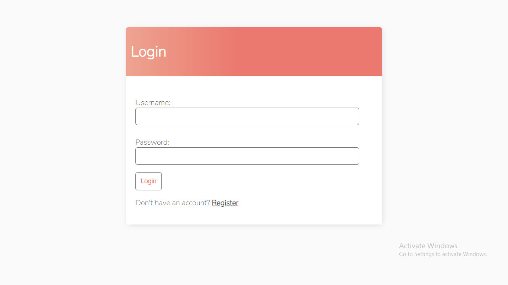
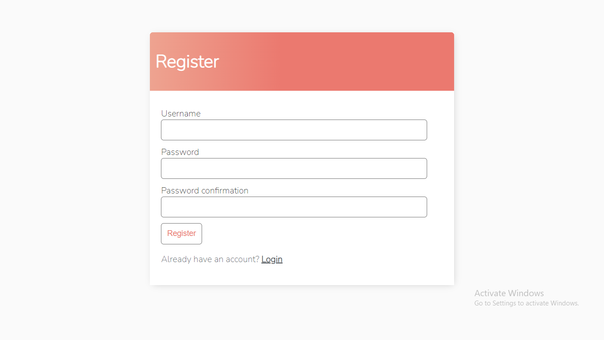
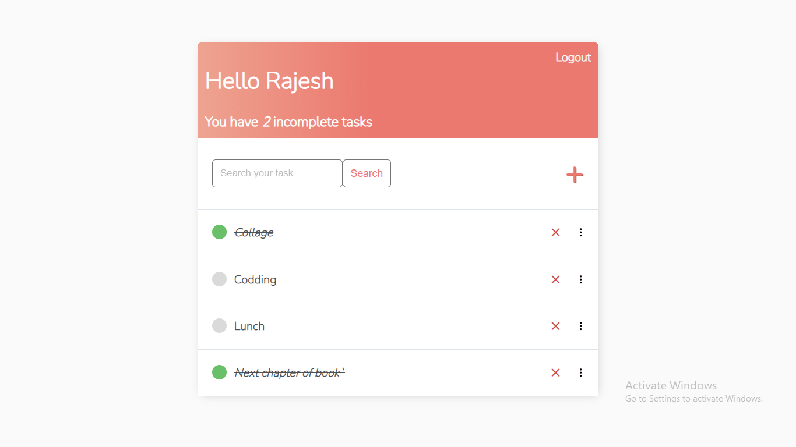
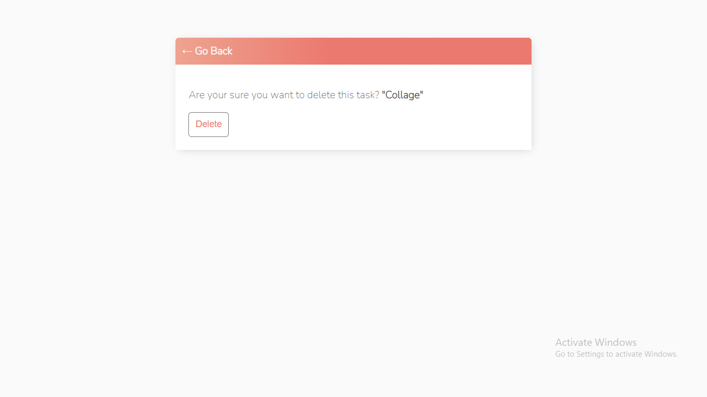

# ToDo_List_with-User-Authentication

 TodoApp is a simple multi-user task management application for tracking personal to-do's within specific to-do lists created using Django.

<h2> Overview </h2>

Semantics behind TodoApp is based on a system where multiple users under management of an admin, can organize their personal to-do tasks within their special to-do lists.

Users can <code> Register </code>  to the system from <code> Register </code>  page (which is accessable through login page) and get started to using TodoApp directly from home page.

 In <code> home page </code> users can display their current set to-do lists and some more related information about them as well as creating, editing or sorting them. Once a user has a to-do list, he/she can access its current set of to-do tasks within the options near that specific to-do list via todos page. 

 In todos page, users can display current not-done to-do's and also the already-done ones. In this page, users can create, edit, delete, sort or mark as done the to-do items.

<h5> Get started to organize and track your stuff accordingly with Awesome TodoApp!! </h5>

 Below there are samples from each page:

<code> Log In </code>

<code> Register </code>

<code> Home </code>

<code> Edit </code>

<code> Delete Page </code>

<h3>Fundamental Features</h3>

<ul>
<li>Simplified and Organized to-do management within special to-do lists</li>
<li>Basic operations (create, delete, edit) with both to-do lists and to-do items</li>
<li>Drag and drop task prioritization for both to-do lists and to-do items</li>
<li>Marking as done/undone feature for tasks</li>
</ul>
